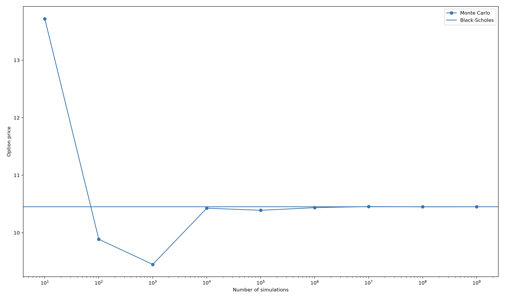

# Monte Carlo Option Pricing

This project explores the mathematics and computational methods behind financial option pricing. I will be learning how Geometric Brownian Motion 
can be used to model stock-price movements and how Monte Carlo simulation can be used to estimate the value of European options.

I will then compare these numerical estimates with prices obtained from the Black–Scholes model, investigating the relationship between 
the two approaches and how the accuracy of Monte Carlo pricing changes as the number of simulations increases.

As the project develops, I also plan to explore methods for improving the efficiency and accuracy of the simulation.

(10,31.27582560288887)
(100,-5.4060472985632275)
(1000,-9.593204129154154)
(10000,-0.23477182553484974)
(100000,-0.5863310378639558)
(1000000,-0.14862658496059097)
(10000000,0.030263204142592655)
(100000000,-0.011721576562296932)
(1000000000,0.001145115010542623)