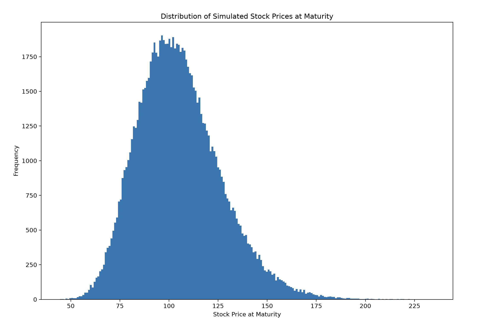

# Monte Carlo Option Pricing: Convergence and Variance Reduction

In this project, I will be investigating European Option Pricing using Monte Carlo Simulation, benchmarked against the analytical Black-Scholes solution.
The main points of investigation are the convergence rate of Monte Carlo pricing and the effectiveness of antithetic variates as a variance-reduction technique.

## Overview

The Black-Scholes model provides a closed-form solution for European Option pricing under a set of assumptions. Monte Carlo methods provide an alternative approach to this using a numerical approach. Possible stock prices are simulated and the discounted average payoff is used as an estimate.
This project uses the black-scholes price as a benchmark to investigate relations between pricing accuracy with number of simulations. I then implement antithetic variates to investigate whether the estimate's variance can be reduced in the same simulation budget.


## Mathematical Background

### Black-Scholes Price

For a European call option, the Black-Scholes price is:

```math
C = S_0N(d_1) - Ke^{-rT}N(d_2)
```

where:

```math
d_1 = \frac{\ln(S_0/K) + (r + \frac{1}{2}\sigma^2)T}{\sigma\sqrt{T}}
```

```math
d_2 = d_1 - \sigma\sqrt{T}
```

This is used as the benchmark for the Monte Carlo estimates.

### Monte Carlo Simulation

The stock price at expiry is simulated using:

```math
S_T = S_0\exp\left(\left(r-\frac{1}{2}\sigma^2\right)T+\sigma\sqrt{T}Z\right)
```

where:

```math
Z \sim N(0,1)
```

For a European call option, the payoff is:

```math
\max(S_T-K,0)
```

Using \(N\) simulations, the Monte Carlo estimate is:

```math
\hat{C}_N = e^{-rT}\frac{1}{N}\sum_{i=1}^{N}\max(S_T^{(i)}-K,0)
```

### Convergence

Monte Carlo error decreases approximately at the rate:

```math
O(N^{-1/2})
```

The absolute pricing error is:

```math
|\hat{C}_N - C_{BS}|
```

### Antithetic Variates

Antithetic variates use pairs of random values:

```math
Z \quad \text{and} \quad -Z
```

These produce negatively related simulated outcomes, helping to reduce the variance of the Monte Carlo estimator.



